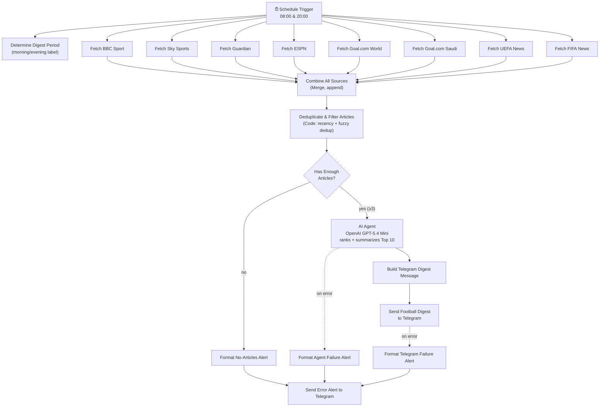

# ⚽ Football News AI Digest — n8n Workflow

A production-ready, self-hosted [n8n](https://n8n.io) automation that collects football news
from 8 free public RSS sources twice a day, deduplicates it, ranks it with an OpenAI
**GPT-5.4 Mini** AI Agent, and sends a beautifully formatted Arabic digest of the **Top 10**
stories to a Telegram chat.

- **Schedule:** every day at **08:00** and **20:00** (Cron trigger)
- **Sources:** 8 free RSS feeds — BBC Sport, Sky Sports, The Guardian, ESPN, Goal.com
  (world + Saudi Arabia edition), UEFA, FIFA — no paid APIs required
- **AI:** OpenAI GPT-5.4 Mini via an n8n **AI Agent** node with a structured output parser
- **Output:** one Telegram message, Top 10 stories, Arabic sports-journalism style
- **Reliability:** per-source retry + continue-on-fail, an empty-pool safety gate, and a
  dedicated Telegram error-alert path for AI/send failures

## Table of contents

- [Architecture](#architecture)
- [Project structure](#project-structure)
- [Prerequisites](#prerequisites)
- [Installation](#installation)
- [Importing the workflow](#importing-the-workflow)
- [Environment variables](#environment-variables)
- [Setting up credentials](#setting-up-credentials)
- [Running manually](#running-manually)
- [Cron schedule](#cron-schedule)
- [Message format](#message-format)
- [Editing the news sources](#editing-the-news-sources)
- [Changing the AI model](#changing-the-ai-model)
- [Error handling & reliability](#error-handling--reliability)
- [Security](#security)
- [Troubleshooting](#troubleshooting)

## Architecture



## Project structure

```
.
├── README.md                              # this file
├── .env.example                           # environment variable template
└── workflows/
    └── football-news-ai-digest.json       # importable n8n workflow
```

## Prerequisites

- A running n8n instance (self-hosted, v1.7x+) with the LangChain nodes available
  (`@n8n/n8n-nodes-langchain` — bundled by default in modern n8n).
- An [OpenAI](https://platform.openai.com) account with API access to the GPT-5.4 family.
- A [Telegram bot](https://core.telegram.org/bots#botfather) (create one via `@BotFather`)
  and the chat ID that should receive the digest.

## Installation

1. Clone this repository (or just copy `workflows/football-news-ai-digest.json` and
   `.env.example` into your n8n project).
2. Copy the environment template and use it as your own reference for the secrets you'll
   enter into n8n in the next steps:
   ```bash
   cp .env.example .env
   ```
3. Set `TELEGRAM_CHAT_ID` — see [Environment variables](#environment-variables) below.
   How you set it depends on whether your n8n plan has the **Variables** feature (see note).

> **Note on n8n Cloud:** Cloud instances block `{{ $env.* }}` access in expressions for
> security and this cannot be changed by end users, so this workflow does **not** use
> `$env`. Instead:
> - If your plan has **Settings → Variables**, use `{{ $vars.TELEGRAM_CHAT_ID }}` in the
>   `chatId` field of both Telegram nodes (works on Cloud and self-hosted alike).
> - **Variables is not available on every n8n Cloud plan.** If you don't see it in
>   Settings, just paste your numeric chat ID directly into the `chatId` field of both
>   Telegram nodes instead. A chat ID is a destination identifier, not a secret — the
>   actual bot token stays safely in the Telegram credential either way.
>
> The shipped `workflows/football-news-ai-digest.json` ships with `chatId` set to the
> placeholder `REPLACE_WITH_YOUR_TELEGRAM_CHAT_ID` — swap in `{{ $vars.TELEGRAM_CHAT_ID }}`
> or your literal chat ID after import, based on which option your plan supports.

## Importing the workflow

1. Open your n8n instance → **Workflows** → **Add workflow** → **Import from File**.
2. Select `workflows/football-news-ai-digest.json`.
3. n8n will create all 27 nodes but will **not** know which credentials to use (they are
   never embedded in the JSON). Open each of the following nodes and select/create the
   matching credential:
   - **OpenAI GPT-5.4 Mini** → an `OpenAI API` credential
   - **Send Football Digest to Telegram** → a `Telegram API` credential
   - **Send Error Alert to Telegram** → the same `Telegram API` credential
4. On both Telegram nodes, replace the `chatId` placeholder as described in the note above.
5. Save, then **Activate** the workflow (top-right toggle) so the Schedule Trigger starts
   firing at 08:00/20:00.

## Environment variables

| Variable            | Where it lives                             | Purpose                                                        |
|----------------------|--------------------------------------------|------------------------------------------------------------------|
| `OPENAI_API_KEY`     | the `OpenAI API` **credential** in n8n     | Authenticates the AI Agent's language model                    |
| `TELEGRAM_TOKEN`     | the `Telegram API` **credential** in n8n   | Authenticates the bot that sends messages                       |
| `TELEGRAM_CHAT_ID`   | an n8n **Variable** (if available) or the `chatId` field directly | Destination chat/channel/group for the digest and error alerts |

`OPENAI_API_KEY` and `TELEGRAM_TOKEN` are entered once into n8n's encrypted credential
store (see below) — the standard, secure way n8n handles secrets; they are never read from
process environment variables by the workflow itself. `.env.example` documents them purely
for your own records / secrets manager.

`TELEGRAM_CHAT_ID` is **not** a secret. Prefer n8n's **Variables** feature
(**Settings → Variables → Add Variable**, key `TELEGRAM_CHAT_ID`) when your plan has it —
it works identically on Cloud and self-hosted, and unlike `{{ $env.* }}` is never blocked
by the `N8N_BLOCK_ENV_ACCESS_IN_NODE` setting Cloud enforces. If Variables isn't available
on your plan, hardcoding the numeric chat ID directly into the `chatId` field of both
Telegram nodes is a reasonable, low-risk fallback.

## Setting up credentials

**OpenAI:**
1. n8n → **Credentials** → **New** → **OpenAI API**.
2. Paste your `OPENAI_API_KEY`. Save as `OpenAI account` (or update the node to point at
   whatever name you choose).

**Telegram:**
1. n8n → **Credentials** → **New** → **Telegram API**.
2. Paste your `TELEGRAM_TOKEN`. Save as `Telegram account`.
3. Get your chat ID — the most reliable way: message **@userinfobot** on Telegram, it
   replies instantly with your numeric user ID, which is the same ID as your private chat
   with any bot you've started. (Alternative: message your own bot once, then call
   `https://api.telegram.org/bot<token>/getUpdates` and read `message.chat.id` from the
   response — this only works if you've already messaged the bot at least once.)
4. Set `TELEGRAM_CHAT_ID` per the [Environment variables](#environment-variables) section
   above (Variables if available, otherwise directly in both Telegram nodes' `chatId` field).

> **If you ever rotate or recreate your bot** (new token from @BotFather), remember to
> **update the token inside the existing `Telegram account` credential** — don't just
> update the chat ID. A stale token in the credential is a common cause of
> `Bad Request: chat not found`, since the workflow would then be sending through a bot
> you never started a conversation with.

## Running manually

- Open the workflow in the n8n editor and click **Test workflow** (▶) to run it once
  on demand — useful for verifying sources/formatting before relying on the schedule.
- You can also trigger it from **Executions** → **Run again** on a previous execution.

## Cron schedule

The **8AM & 8PM Trigger** node uses a Schedule Trigger with two cron rules:

```
0 8 * * *    → every day at 08:00
0 20 * * *   → every day at 20:00
```

Both run in the n8n instance's configured timezone. To change the times, open the node and
edit (or add/remove) rules under **Trigger Rules**. To run more/less often, add or remove
`cronExpression` rules — no code changes required.

## Message format

```
🏆 أهم أخبار كرة القدم
📅 التحديث الصباحي
━━━━━━━━━━━━━━
1️⃣ ⚽ <عنوان الخبر>
📰 <ملخص من جملتين إلى ثلاث جمل، حتى 80 كلمة>
🌍 <المصدر>
🕒 <وقت النشر>
🔗 <الرابط الأصلي>
━━━━━━━━━━━━━━
... (حتى 10 أخبار) ...
🤖 تم الإنشاء تلقائيًا بواسطة n8n + OpenAI
```

## Editing the news sources

Each source is its own **RSS Read** node (`Fetch <Source Name>`) feeding into the
**Combine All Sources** merge node. To:

- **Change a feed URL:** open the node, edit the `URL` field.
- **Add a source:** duplicate any `Fetch …` node, set its URL, increase
  `Combine All Sources` → `Number of Inputs` by 1, and connect the new node to the next
  free input. Add its domain → display-name mapping in the `SOURCE_MAP` array inside the
  **Deduplicate & Filter Articles** code node so it's labeled correctly in the digest.
- **Remove a source:** delete the node, decrease `Number of Inputs` on the merge node by 1,
  and re-connect the remaining inputs so there are no gaps.

All RSS nodes have `Retry On Fail` + `Continue On Fail` set, so a single broken/slow feed
never blocks the other sources or the schedule.

## Changing the AI model

Open the **OpenAI GPT-5.4 Mini** node (the language-model sub-node feeding the AI Agent) and
change the **Model** field to any available OpenAI chat model (e.g. `gpt-5.4`, `gpt-5.4-pro`,
`gpt-5-mini`). No other node needs to change — the Agent, prompt, and structured output
schema are model-agnostic. Adjust `temperature` / `maxTokens` in the same node if you switch
to a larger or smaller model.

## Error handling & reliability

- **Per-source isolation:** every RSS node has `retryOnFail` (3 tries, 2s apart) and
  `onError: continueRegularOutput`, so one dead/slow feed cannot break the run.
- **Empty-pool safety gate:** the **Has Enough Articles?** IF node checks that at least 3
  articles survived deduplication before spending an AI call — if every source fails, the
  workflow sends a "not enough news collected" alert instead of calling the AI on an empty
  list.
- **AI failure alert:** the AI Agent node retries (3×, 3s apart) and, on a final failure,
  routes to a dedicated Telegram error alert instead of failing silently.
- **Delivery failure alert:** the main Telegram send node also retries (3×) and routes
  failures to the same error-alert path (best effort — if Telegram itself is unreachable,
  check the n8n Executions log directly).
- All three failure paths converge on one **Send Error Alert to Telegram** node so you get
  a single, consistent notification channel for anything that goes wrong.

## Security

- No API keys or bot tokens are hardcoded anywhere in `workflows/football-news-ai-digest.json` — they live only in n8n's encrypted credential store.
- `TELEGRAM_CHAT_ID` is a destination identifier, not a secret; depending on your plan it's either an n8n Variable or a plain value in the `chatId` field — either way the bot token stays in the credential.
- Never paste a bot token (or any secret) into a node's **Notes** field or into chat with an assistant helping you debug — Notes are stored in plain text as part of the workflow and are easy to forget about. If you ever do this by accident, remove it immediately and rotate the token via @BotFather.
- `.env` (with real secrets) should **never** be committed — only `.env.example` is tracked.

## Troubleshooting

| Symptom | Likely cause | Fix |
|---|---|---|
| Workflow doesn't fire at 08:00/20:00 | Workflow not activated, or instance timezone unexpected | Toggle **Active** on; check **Settings → Timezone** on the workflow/instance |
| Telegram send fails with `Bad Request: chat not found` | `chatId` is wrong/empty, the bot was never messaged first, **or the Telegram credential holds a different bot's token than the one you actually started a chat with** | Confirm the token in the `Telegram account` credential matches the bot you messaged; get the correct chat ID via `@userinfobot` (see [Setting up credentials](#setting-up-credentials)) |
| `{{ $vars.TELEGRAM_CHAT_ID }}` resolves to empty | The n8n Variable doesn't exist, or Variables isn't available on your plan | **Settings → Variables** → add it; if the menu doesn't exist on your plan, hardcode the chat ID directly in the `chatId` field instead |
| `"access to env vars denied"` error on a Telegram node | A node uses `{{ $env.TELEGRAM_CHAT_ID }}` (blocked on n8n Cloud) | Switch the `chatId` field to `{{ $vars.TELEGRAM_CHAT_ID }}` (if Variables is available) or a literal chat ID |
| Getting `getUpdates` returns `{"ok":true,"result":[]}` | You haven't actually messaged the bot yet (bots can't message you first), or you're checking before sending | Open the bot in Telegram and press **Start** / send any message, then retry — or just use `@userinfobot` instead, which needs no bot interaction at all |
| One RSS source frequently errors | Feed URL changed/blocked | Update the URL on that `Fetch …` node — the rest of the pipeline is unaffected either way |
| Digest has fewer than 10 stories | Fewer than 10 articles survived filtering that cycle | Expected behavior — the AI only returns stories that pass the quality bar |
| "No-Articles" alert fires often | Recency window (16h) too strict for your sources, or dedup threshold too aggressive | Adjust `RECENCY_HOURS` / `MIN_SIMILARITY` in the **Deduplicate & Filter Articles** code node |
| AI output doesn't match schema / empty digest | Model doesn't support structured output well, or `hasOutputParser` disabled | Keep `hasOutputParser: true` on the AI Agent node; try a different GPT-5.4 variant |
